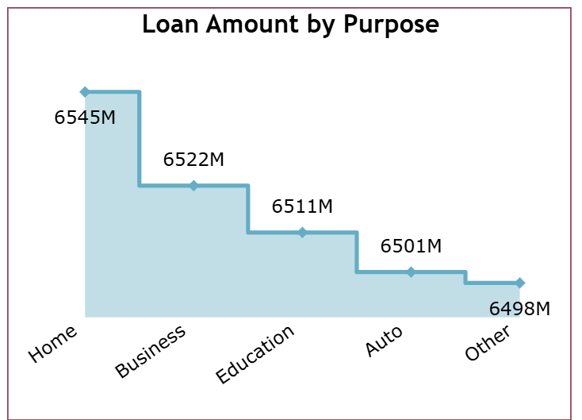
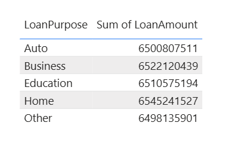
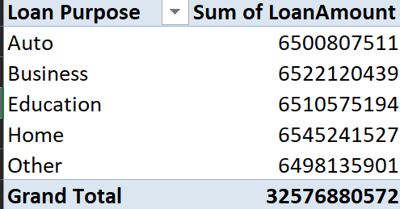
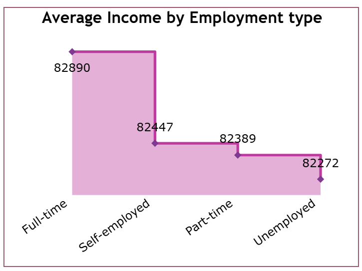
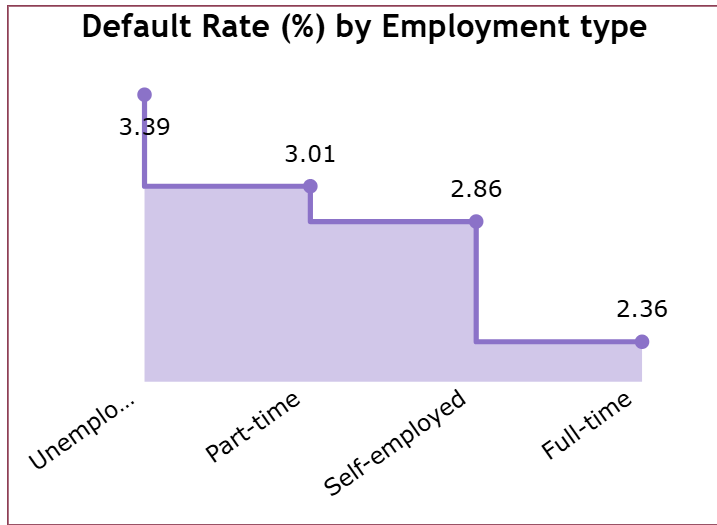
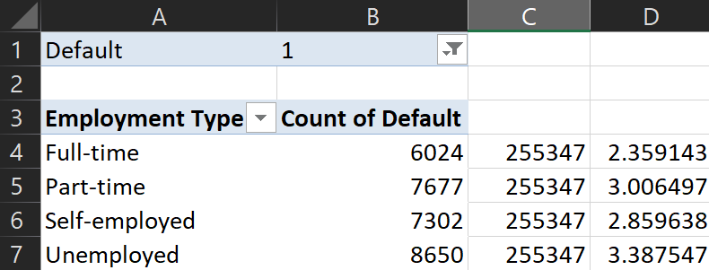
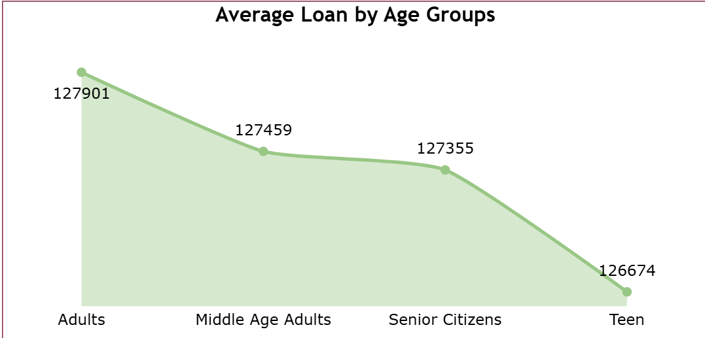
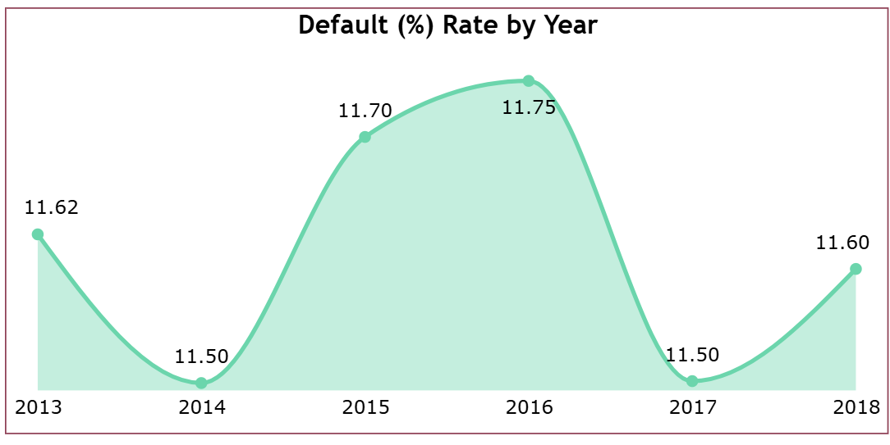
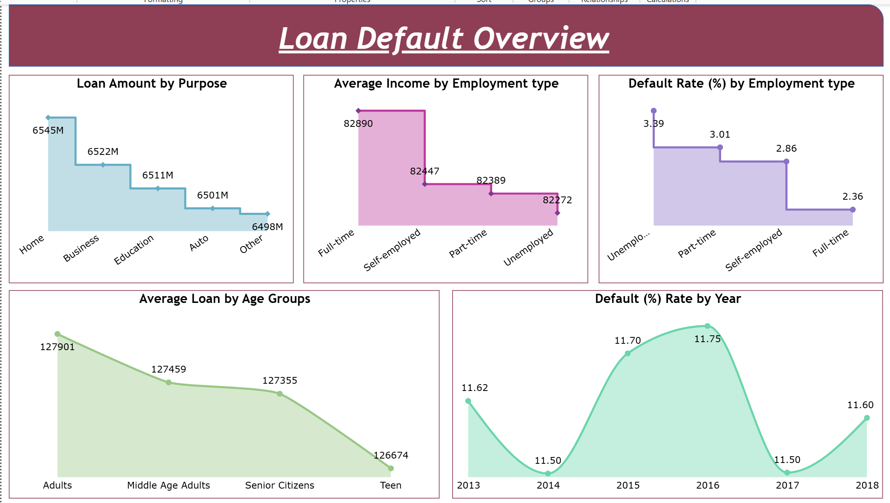

# End-to-End Power BI Project 1

### Data Source - Data Flow

### Steps followed

- Step 1 : Open Power BI Service and sign in to the account. Go to Workspaces and create a New Workspace by providing a workspace name.

- Step 2 : Download and install the Standard Mode On-premises Data Gateway. Configure the gateway by providing a Gateway name and Recovery key.

- Step 3 : Install Microsoft SQL Server to store and manage the project data before connecting it to the Power BI Dataflow.

- Step 4 : Open SQL Server Management Studio (SSMS), create a new database named Loan, and use the Loan database.

- Step 5 : In Object Explorer, go to Databases → Loan → Tasks → Import Flat File and import the Loan Default.csv file.

- Step 6 : Verify the imported data by querying the Loan Default table using the query `SELECT * FROM dbo.[Loan Default];`.

- Step 7 : Open Power BI Service, go to the newly created Workspace, select New Item → Dataflow, and choose Dataflow Gen1.

- Step 8 : Select Define new tables and choose Add new table. Select SQL Server as the data source.

- Step 9 : Provide the SQL Server connection details and select the On-premises Data Gateway. Select Windows authentication and provide the required username and password.

- Step 10 : After establishing the connection, select the Loan Default table. Power Query Online opens for data transformation.

- Step 11 : Save and close the Dataflow using the Save & Close option.

- Step 12 : Open Power BI Desktop and select Get Data → More → Dataflows.

- Step 13 : Select the Dataflows option and connect to the Dataflow created in Power BI Service.

- Step 14 : In the Navigator window, select the Dataflow, Loan Default, and Loan Data.

- Step 15 : Created a Year column from the Loan Date DDMMYYYY column using the DAX `YEAR` function.

- Step 16 : Created a separate Measures Table 1 to store the measures used for Page 1 of the report.

- Step 17 : A new measure was created to calculate the total loan amount for records where the loan amount is not blank.

  Following DAX expression was written to calculate the loan amount,

        Loan Amount by Purpose =
        SUMX(
            FILTER(
                'Loan Default',
                NOT (ISBLANK('Loan Default'[Loan Amount])
            )),
            'Loan Default'[Loan Amount]
        )

   A line chart was used to represent the loan amount by loan purpose, with Loan Purpose on the X-axis and Loan Amount by Purpose on the Y-axis.

  Snap of the line chart:

- Step 18 : The DAX measure was validated by creating a temporary table visual using Loan Purpose and Loan Amount with the aggregation set to SUM. The values were compared with the results obtained from the DAX measure.

  Snap of the table visual:

- Step 19 : The results were further validated using a PivotTable in the original Excel dataset by placing Loan Purpose in Rows and Loan Amount in Values.

  Snap of the PivotTable:

 - Step 20 : A new measure was created to calculate the average income by employment type.

  Following DAX expression was written to calculate the average income by employment type,

        Average Income by Employment type = 
        CALCULATE(AVERAGE('Loan_default'[Income]),ALLEXCEPT('Loan_default','Loan_default'[EmploymentType]))

  A line chart was used to represent the average income by employment type, with Employment Type on the X-axis and Average Income by Employment type on the Y-axis.

  A line chart was used to represent the average income by employment type, with Employment Type on the X-axis and Average Income by Employment Type on the Y-axis.

  Snap of the line chart:

- Step 21 : The use of the ALLEXCEPT function ensures that the measure responds to the Employment Type filter while ignoring other filters affecting the calculation.

  When a value from the Average Income by Employment Type chart is selected, the Loan Amount by Purpose chart changes according to the selected Employment Type. However, selecting a value from the Loan Amount by Purpose chart does not change the Average Income by Employment Type values because the measure retains only the Employment Type filter.

- Step 22 : The Average Income by Employment type measure was validated using a table visual in Power BI by comparing the calculated values with the average Income for each Employment Type.

- Step 23 : The results were further validated using the original Excel dataset by creating a PivotTable with Employment Type in Rows and Income in Values, with the aggregation set to Average. The values matched the results obtained from the DAX measure.  

- Step 24 : A new measure was created to calculate the default rate by employment type. Variables were used to calculate the total number of records and the total number of default cases.

  Following DAX expression was written to calculate the default rate by employment type,

        Default Rate by Employment type = 

        VAR totalrecords=COUNTROWS(ALl('Loan_default'))

        VAR DefaultCases=COUNTROWS(FILTER('Loan_default','Loan_default'[Default]=TRUE()))

        RETURN 

        CALCULATE(DIVIDE(DefaultCases,totalrecords),ALLEXCEPT('Loan_default',Loan_default[EmploymentType]))*100

  A line chart was used to represent the default rate by employment type, with Employment Type on the X-axis and Default Rate by Employment type on the Y-axis.

  Snap of the line chart:

  

- Step 26 : The Default Rate by Employment type measure was validated using a table visual in Power BI. Employment Type and Default were added to the visual. The Default column was added again and its aggregation was changed to Count, which was then displayed as a percentage. The percentage for Default = TRUE was compared with the values obtained from the DAX measure.

- Step 27 : The results were further validated using the original Excel dataset by creating a PivotTable with Employment Type in Rows and Default in Values with the aggregation set to Count. Default was also added to the Filters area and filtered for the value 1 (TRUE). The count for each Employment Type was divided by the total number of default cases (we can get this from PBI validation table, it comes out to be 255347, bring it to excel sheet (c4,c7) corresponding to the count of default values (let say existing from b4,b7) and then divide ) to calculate the default rate. The resulting percentages matched the values obtained from the DAX measure.  

  Snap of the Excel validation:

  

- Step 28 : An Age Groups calculated column was created because the original dataset did not contain an age group column. The Age column was used to categorize customers into Teen, Adults, Middle Age Adults, and Senior Citizens.

  Following DAX expression was written to create the Age Groups column,

        Age Groups = 
        IF('Loan_default'[Age]<=19,"Teen",
            IF('Loan_default'[Age]<=39,"Adults",
                IF('Loan_default'[Age]<=59,"Middle Age Adults",
                "Senior Citizens")))

- Step 29 : A new measure was created in Measures Table 1 to calculate the average loan amount by age group using the AVERAGEX and VALUES functions.

  Following DAX expression was written to calculate the average loan amount by age group,

        Average Loan by Age Groups = 
        AVERAGEX(VALUES('Loan_default'[Age Groups]),AVERAGE('Loan_default'[LoanAmount]))

  A line chart was used to represent the average loan amount by age group, with Age Groups on the X-axis and Average Loan by Age Groups on the Y-axis.

  Snap of the line chart:

- Step 30 : The Average Loan by Age Groups measure was validated using a table visual in Power BI by adding Age Groups and the average of LoanAmount.

- Step 31 : The results were further validated using the original Excel dataset by using Age as a filter, selecting the required age groups, and calculating the Average of Loan Amount in the Values section. The values matched the results obtained from the DAX measure.

- Step 32 : A new measure was created to calculate the default rate by year. Variables were used to calculate the total number of loans and the total number of default cases for each year.

  Following DAX expression was written to calculate the default rate by year,

        Default rate by Year = 
        VAR TotalLoans=
                        CALCULATE(COUNTROWS('Loan_default'),ALLEXCEPT('Loan_default',Loan_default[Year]))

        VAR Default= CALCULATE(COUNTROWS(FILTER('Loan_default','Loan_default'[Default]=TRUE())),ALLEXCEPT('Loan_default',Loan_default[Year]))  

        RETURN
        DIVIDE(Default,TotalLoans)*100

  A line chart was used to represent the default rate by year, with Year on the X-axis and Default rate by Year on the Y-axis.

  Snap of the line chart:

- Step 33 : The Default rate by Year measure was validated using a table visual in Power BI by adding Year and Default, with the Default field aggregated as Count. The calculated values were compared with the results obtained from the DAX measure.

### Loan Default Overview

The Loan Default Overview page looks like this:

