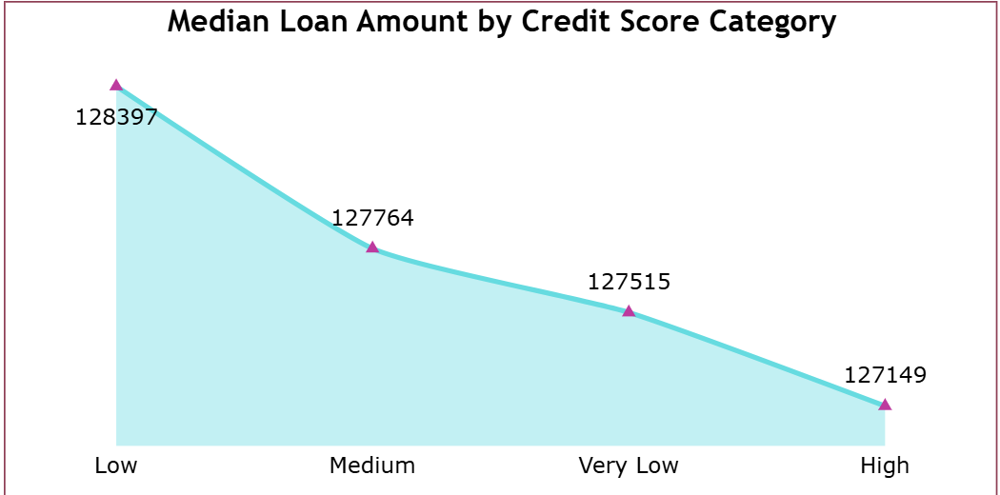
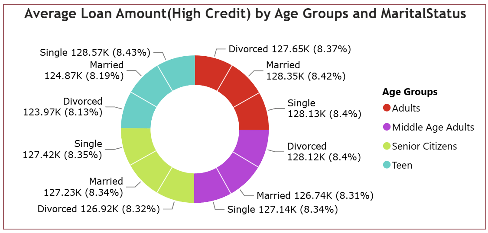
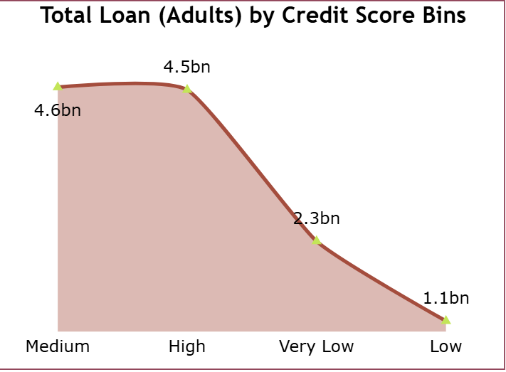
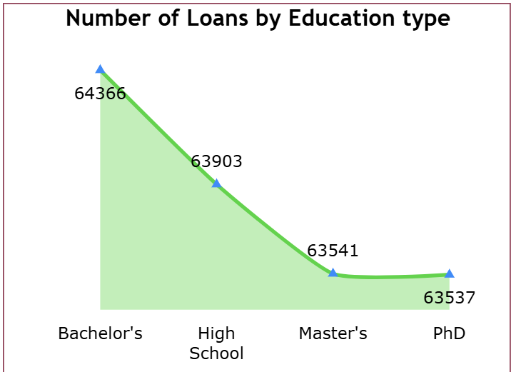
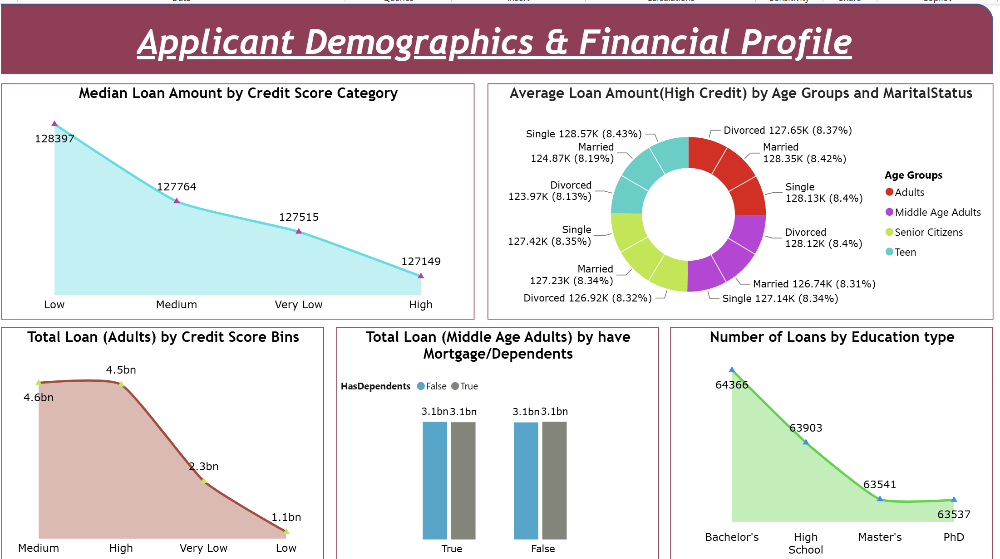

# End-to-End Power BI Project 1

### Data Source - Data Flow

### Steps followed

- Step 1 : Open Power BI Service and sign in to the account. Go to Workspaces and create a New Workspace by providing a workspace name.

- Step 2 : Download and install the Standard Mode On-premises Data Gateway. Configure the gateway by providing a Gateway name and Recovery key.

- Step 3 : Install Microsoft SQL Server to store and manage the project data before connecting it to the Power BI Dataflow.

- Step 4 : Open SQL Server Management Studio (SSMS), create a new database named Loan, and use the Loan database.

- Step 5 : In Object Explorer, go to Databases → Loan → Tasks → Import Flat File and import the Loan Default.csv file.

- Step 6 : Verify the imported data by querying the Loan Default table using the query `SELECT * FROM dbo.[Loan Default];`.

- Step 7 : Open Power BI Service, go to the newly created Workspace, select New Item → Dataflow, and choose Dataflow Gen1.

- Step 8 : Select Define new tables and choose Add new table. Select SQL Server as the data source.

- Step 9 : Provide the SQL Server connection details and select the On-premises Data Gateway. Select Windows authentication and provide the required username and password.

- Step 10 : After establishing the connection, select the Loan Default table. Power Query Online opens for data transformation.

- Step 11 : Save and close the Dataflow using the Save & Close option.

- Step 12 : Open Power BI Desktop and select Get Data → More → Dataflows.

- Step 13 : Select the Dataflows option and connect to the Dataflow created in Power BI Service.

- Step 14 : In the Navigator window, select the Dataflow, Loan Default, and Loan Data.

- Step 15 : Created a Year column from the Loan Date DDMMYYYY column using the DAX `YEAR` function.

- Step 16 : Created a separate Measures Table 1 to store the measures used for Page 1 of the report.

- Step 17 : A new measure was created to calculate the total loan amount for records where the loan amount is not blank.

  Following DAX expression was written to calculate the loan amount,

        Loan Amount by Purpose =
        SUMX(
            FILTER(
                'Loan Default',
                NOT (ISBLANK('Loan Default'[Loan Amount])
            )),
            'Loan Default'[Loan Amount]
        )

   A line chart was used to represent the loan amount by loan purpose, with Loan Purpose on the X-axis and Loan Amount by Purpose on the Y-axis.

  Snap of the line chart:

- Step 18 : The DAX measure was validated by creating a temporary table visual using Loan Purpose and Loan Amount with the aggregation set to SUM. The values were compared with the results obtained from the DAX measure.

  Snap of the table visual:

- Step 19 : The results were further validated using a PivotTable in the original Excel dataset by placing Loan Purpose in Rows and Loan Amount in Values.

  Snap of the PivotTable:

 - Step 20 : A new measure was created to calculate the average income by employment type.

  Following DAX expression was written to calculate the average income by employment type,

        Average Income by Employment type = 
        CALCULATE(AVERAGE('Loan_default'[Income]),ALLEXCEPT('Loan_default','Loan_default'[EmploymentType]))

  A line chart was used to represent the average income by employment type, with Employment Type on the X-axis and Average Income by Employment type on the Y-axis.

  A line chart was used to represent the average income by employment type, with Employment Type on the X-axis and Average Income by Employment Type on the Y-axis.

  Snap of the line chart:

- Step 21 : The use of the ALLEXCEPT function ensures that the measure responds to the Employment Type filter while ignoring other filters affecting the calculation.

  When a value from the Average Income by Employment Type chart is selected, the Loan Amount by Purpose chart changes according to the selected Employment Type. However, selecting a value from the Loan Amount by Purpose chart does not change the Average Income by Employment Type values because the measure retains only the Employment Type filter.

- Step 22 : The Average Income by Employment type measure was validated using a table visual in Power BI by comparing the calculated values with the average Income for each Employment Type.

- Step 23 : The results were further validated using the original Excel dataset by creating a PivotTable with Employment Type in Rows and Income in Values, with the aggregation set to Average. The values matched the results obtained from the DAX measure.  

- Step 24 : A new measure was created to calculate the default rate by employment type. Variables were used to calculate the total number of records and the total number of default cases.

  Following DAX expression was written to calculate the default rate by employment type,

        Default Rate by Employment type = 

        VAR totalrecords=COUNTROWS(ALl('Loan_default'))

        VAR DefaultCases=COUNTROWS(FILTER('Loan_default','Loan_default'[Default]=TRUE()))

        RETURN 

        CALCULATE(DIVIDE(DefaultCases,totalrecords),ALLEXCEPT('Loan_default',Loan_default[EmploymentType]))*100

  A line chart was used to represent the default rate by employment type, with Employment Type on the X-axis and Default Rate by Employment type on the Y-axis.

  Snap of the line chart:

  

- Step 25 : The Default Rate by Employment type measure was validated using a table visual in Power BI. Employment Type and Default were added to the visual. The Default column was added again and its aggregation was changed to Count, which was then displayed as a percentage. The percentage for Default = TRUE was compared with the values obtained from the DAX measure.

- Step 26 : The results were further validated using the original Excel dataset by creating a PivotTable with Employment Type in Rows and Default in Values with the aggregation set to Count. Default was also added to the Filters area and filtered for the value 1 (TRUE). The count for each Employment Type was divided by the total number of default cases (The total number of default cases obtained from the Power BI validation table was used as the denominator in Excel to calculate the default rate for each employment type ) to calculate the default rate. The resulting percentages matched the values obtained from the DAX measure.  

  Snap of the Excel validation:

  

- Step 27 : An Age Groups calculated column was created because the original dataset did not contain an age group column. The Age column was used to categorize customers into Teen, Adults, Middle Age Adults, and Senior Citizens.

  Following DAX expression was written to create the Age Groups column,

        Age Groups = 
        IF('Loan_default'[Age]<=19,"Teen",
            IF('Loan_default'[Age]<=39,"Adults",
                IF('Loan_default'[Age]<=59,"Middle Age Adults",
                "Senior Citizens")))

- Step 28 : A new measure was created in Measures Table 1 to calculate the average loan amount by age group using the AVERAGEX and VALUES functions.

  Following DAX expression was written to calculate the average loan amount by age group,

        Average Loan by Age Groups = 
        AVERAGEX(VALUES('Loan_default'[Age Groups]),AVERAGE('Loan_default'[LoanAmount]))

  A line chart was used to represent the average loan amount by age group, with Age Groups on the X-axis and Average Loan by Age Groups on the Y-axis.

  Snap of the line chart:

- Step 29 : The Average Loan by Age Groups measure was validated using a table visual in Power BI by adding Age Groups and the average of LoanAmount.

- Step 30 : The results were further validated using the original Excel dataset by using Age as a filter, selecting the required age groups, and calculating the Average of Loan Amount in the Values section. The values matched the results obtained from the DAX measure.

- Step 31 : A new measure was created to calculate the default rate by year. Variables were used to calculate the total number of loans and the total number of default cases for each year.

  Following DAX expression was written to calculate the default rate by year,

        Default rate by Year = 
        VAR TotalLoans=
                        CALCULATE(COUNTROWS('Loan_default'),ALLEXCEPT('Loan_default',Loan_default[Year]))

        VAR Default= CALCULATE(COUNTROWS(FILTER('Loan_default','Loan_default'[Default]=TRUE())),ALLEXCEPT('Loan_default',Loan_default[Year]))  

        RETURN
        DIVIDE(Default,TotalLoans)*100

  A line chart was used to represent the default rate by year, with Year on the X-axis and Default rate by Year on the Y-axis.

  Snap of the line chart:

- Step 32 : The Default rate by Year measure was validated using a table visual in Power BI by adding Year and Default, with the Default field aggregated as Count. The calculated values were compared with the results obtained from the DAX measure.

### Loan Default Overview

The Loan Default Overview page looks like this:

- Step 33 : A new Measures Table 2 was created to store the measures used on the new report page.

- Step 34 : A new page was added to the Power BI report and named **Applicant Demographics and Financial Profile**.

- Step 35 : A new measure was created to calculate the median loan amount using the MEDIANX DAX function.

  Following DAX expression was written to calculate the median loan amount,

        Median by Credit Score Bins = 
        MEDIANX('Loan_default','Loan_default'[LoanAmount])

  A card visual was used to represent the calculated median loan amount. The card displayed a value of approximately 127.56K.

- Step 36 : The median loan amount was manually validated using the Loan Amount column.

  The Loan Amount column was sorted in ascending order, and the column profile was checked using the complete dataset. The total number of records was 255347, and the middle observation was identified based on the total number of records.

  An Index column starting from 1 was used to locate the middle observation. The Loan Amount corresponding to the middle observation was checked and compared with the value displayed in the card visual.

  The manually checked median value matched the value obtained from the MEDIANX measure.

- Step 37 : A Credit Score Bins calculated column was created in the Loan_default table to categorize customers based on their credit score.

  The credit score was divided into four categories: Very Low, Low, Medium, and High.

  Following DAX expression was written to create the Credit Score Bins column,

        Credit Score Bins = 
        IF(Loan_default[CreditScore]<=400,"Very Low",
            IF('Loan_default'[CreditScore]<=450,"Low",
                IF('Loan_default'[CreditScore]<=650,"Medium",
                "High")))

- Step 38 : The card visual used to represent the overall median loan amount was removed.

  A line chart was created to represent the median loan amount by credit score category, with Credit Score Bins on the X-axis and Median by Credit Score Bins on the Y-axis.

  Snap of the line chart:

- Step 39 : A new measure was created to calculate the average loan amount for customers with High credit score.

  Following DAX expression was written to calculate the average loan amount for High credit customers,

        Average Loan Amount(High Credit) = 
        AVERAGEX(FILTER('Loan_default','Loan_default'[Credit Score Bins]="High"),'Loan_default'[LoanAmount])

- Step 40 : A donut chart was created to represent the average loan amount for High credit customers by age group and marital status. Average Loan Amount(High Credit) was added to Values, Marital Status was added to Details, and Age Groups was added to Legend.

  Snap of the donut chart:

- Step 41 : The Average Loan Amount(High Credit) measure was validated using a table visual in Power BI by adding Marital Status, Age Groups, Credit Score Bins, and Loan Amount with the aggregation set to Average. The values were compared with the results obtained from the measure.

- Step 42 : The results were further validated using the original Excel dataset. Since the original dataset did not contain a separate identifier for High credit customers, a helper column was created to identify customers with a High credit score.

  Following Excel formula was used to create the Credit Bin High Credit column,

        =IF(E2>650,"High","N/A")

  A PivotTable was then created with Marital Status in Rows and Average of Loan Amount in Values. The Credit Bin High Credit field was added to the Filters area and filtered for High.

  Age was then used as a filter, and the values 18 and 19 were selected to represent the Teen age group. The resulting average loan amounts were compared with the values obtained from the Power BI measure.

- Step 43 : A new measure was created in Measures Table 2 to calculate the total loan amount for Adults by credit score bins.

  Following DAX expression was written to calculate the total loan amount for Adults by credit score bins,

        Total Loan (Credit Bins) = 
        CALCULATE(SUM('Loan_default'[LoanAmount]),'Loan_default'[Age Groups]="Adults",ALLEXCEPT('Loan_default','Loan_default'[Age],'Loan_default'[Age Groups],'Loan_default'[CreditScore],'Loan_default'[Credit Score Bins]))

  A line chart was used to represent the total loan amount by credit score bins, with Credit Score Bins on the X-axis and Total Loan (Credit Bins) on the Y-axis.

  Snap of the line chart:

- Step 44 : The Total Loan (Credit Bins) measure was validated using a table visual in Power BI by adding Age Groups, Credit Score Bins, and Loan Amount with the aggregation set to Sum. The values were compared with the results obtained from the measure.

- Step 45 : The results were further validated using the original Excel dataset. Since the original dataset did not contain an Age Groups column, a helper column was created to identify the Adult age group.

  Following Excel formula was used to create the Age Group Adults column,

        =IF(AND(B2>=20,B2<=39),"Adults","N/A")

  A PivotTable was then created with Age Group Adults in the Filters area and Credit Score Bins in Rows. The Age Group Adults filter was set to Adults, and Loan Amount was added to Values with the aggregation set to Sum.

  The resulting total loan amounts were compared with the values obtained from the Power BI measure.

- Step 46 : A new measure was created in Measures Table 2 to calculate the total loan amount for Middle Age Adults.

  Following DAX expression was written to calculate the total loan amount for Middle Age Adults,

        Total Loan (Middle Age Adults) = 
        SUMX(FILTER('Loan_default','Loan_default'[Age Groups]="Middle Age Adults"),'Loan_default'[LoanAmount])

- Step 47 : A clustered column chart was created to represent the total loan amount for Middle Age Adults by mortgage and dependent status. HasMortgage was added to the X-axis, Total Loan (Middle Age Adults) was added to the Y-axis, and HasDependents was added to the Legend.

  Snap of the clustered column chart:

- Step 48 : The Total Loan (Middle Age Adults) measure was validated using a table visual in Power BI by adding HasMortgage, HasDependents, and Loan Amount with the aggregation set to Sum. The values were compared with the results obtained from the measure.

- Step 49 : The results were further validated using the original Excel dataset. Since the original dataset did not contain an identifier for Middle Age Adults, a helper column was created to identify customers between 40 and 59 years of age.

  Following Excel formula was used to create the Middle Age Adults column,

        =IF(AND(B2>=40,B2<=59),"Middle Age Adults","N/A")

  A PivotTable was then created with the Middle Age Adults column in the Filters area and filtered for Middle Age Adults. HasMortgage was also added to the Filters area and filtered for Yes. HasDependents was added to Rows, and Loan Amount was added to Values with the aggregation set to Sum.

  The resulting total loan amounts were compared with the values obtained from the Power BI measure.

- Step 50 : A new measure was created in Measures Table 2 to calculate the total number of loans by education type.

  Following DAX expression was written to calculate the number of loans by education type,

        Loans by Education Type = 
        COUNTROWS(FILTER('Loan_default',NOT(ISBLANK('Loan_default'[LoanID]))))

  The measure uses COUNTROWS along with the ISBLANK and NOT functions to count only those records where Loan ID is not blank.

  A line chart was used to represent the number of loans by education type, with Education on the X-axis and Loans by Education Type on the Y-axis.

  Snap of the line chart:

- Step 51 : The Loans by Education Type measure was validated using a table visual in Power BI by adding Education and Loan ID with the aggregation set to Count. Loan ID was also filtered using advanced filtering to include only records where Loan ID is not blank.

  The resulting counts were compared with the values obtained from the measure.

- Step 52 : The second page of the Power BI report was completed with the above visuals and validations.

### Applicant Demographics & Financial Profile

The Applicant Demographics & Financial Profile page looks like this:

